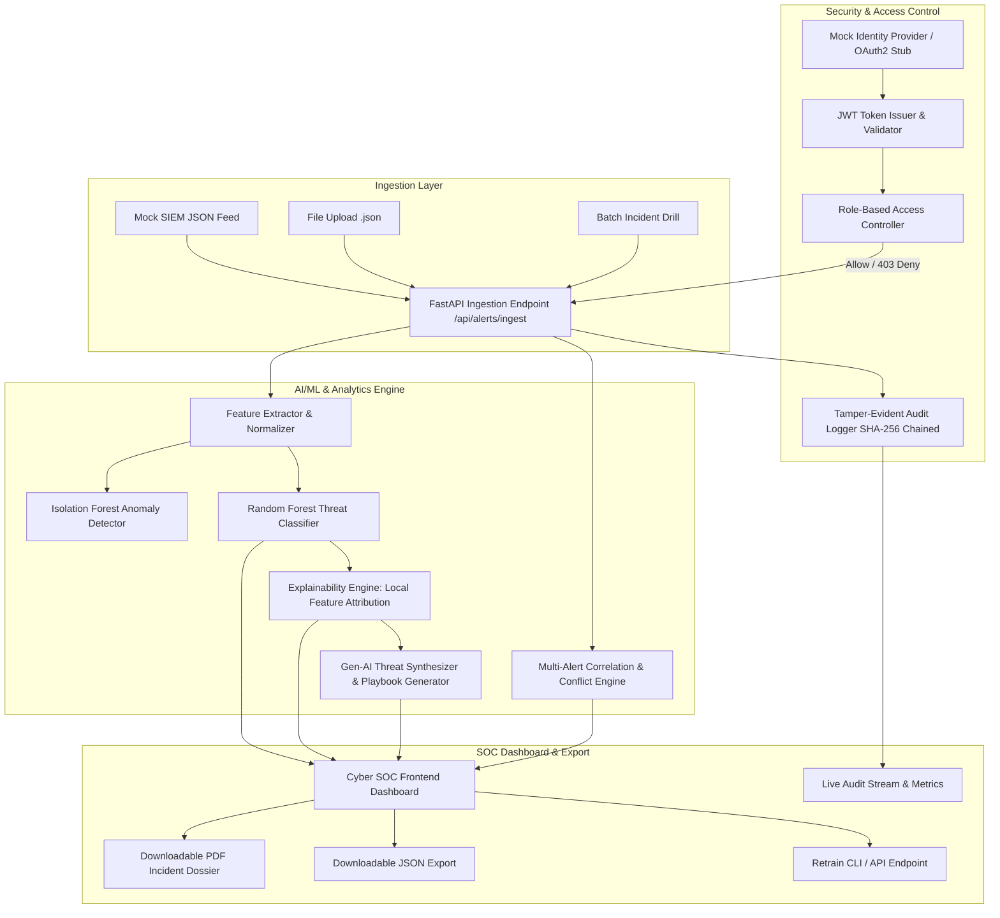

# ThreatSynth 79 — Autonomous Real-Time Threat Triage, Correlation & Access Control System

[](https://www.python.org/)
[](https://fastapi.tiangolo.com/)
[](https://scikit-learn.org/)
[](https://jwt.io/)
[]()
[-brightgreen.svg)]()

> **ThreatSynth 79** is a production-grade cybersecurity system engineered for a mid-sized fintech startup undergoing an incident response drill. It ingests noisy SIEM security alerts, extracts cyber-telemetry features, scores multi-class threat risk with ML (High, Medium, Low), detects zero-day anomalies, produces explainable SHAP-style factor attributions and Gen-AI incident playbooks, correlates multi-event attack chains, and enforces strict Identity-Based Role-Based Access Controls (RBAC) with cryptographic audit logging.

---

## 📌 Problem Statement & Context

During a routine penetration test and 6-hour incident response drill, a fintech startup's SIEM produces a flood of noisy, overlapping alerts. The SOC team lacks real-time correlation, decision explainability, and granular access controls to safeguard sensitive customer payment data. 

**ThreatSynth 79** solves this by delivering:
1. **Real-Time Alert Ingestion (< 15ms)** via JSON webhooks or file upload.
2. **Hybrid AI/ML Classification & Anomaly Detection** using Random Forest and Isolation Forest.
3. **Explainability Engine (SHAP-Style)** breaking down exact feature weights driving the risk score.
4. **Gen-AI Threat Synthesis & Playbook Generator** mapping alerts to MITRE ATT&CK tactics and producing step-by-step containment checklists.
5. **Multi-Alert Correlation & Conflict Rule Engine** detecting attack chains (e.g. Brute Force followed by Privilege Escalation, Impossible Travel).
6. **Strict Identity-Based Access Control (RBAC)** ensuring only authorized SOC Analysts and Admins can view sensitive forensics, while unauthorized users receive **HTTP 403 Forbidden**.
7. **Tamper-Evident Audit Ledger (SHA-256 Chained)** logging every access attempt and rejection.
8. **Downloadable Incident Reports (PDF & JSON)** for compliance and post-incident review.

---

## 🏛️ System Architecture



---

## 🎯 Requirements & Deliverables Matrix

| Requirement / Scope | ThreatSynth 79 Implementation | Verification |
| :--- | :--- | :--- |
| **Ingest 3-5+ Alerts (JSON)** | Ingests single, batch, and uploaded JSON files via `/api/alerts/ingest` and `/api/alerts/upload`. | `tests/test_ingestion.py` |
| **Lightweight ML Classifier** | Ensemble Random Forest + Isolation Forest classifying `High`, `Medium`, `Low` risk. | `tests/test_ml_model.py` |
| **ML Explainability (SHAP)** | Computes local feature attribution scores and plain-English factor summaries. | `threatsynth/ml/explainability.py` |
| **Identity-Based RBAC** | JWT Auth with roles: `admin`, `soc_analyst`, `tier1_viewer`, `unauthorized_guest`. | `tests/test_auth_rbac.py` |
| **403 Unauthorized Rejection** | Unauthorized users blocked from sensitive forensics; events logged in audit ledger. | `tests/test_auth_rbac.py` |
| **Gen-AI Threat Synthesis** | Generates executive incident briefings, MITRE ATT&CK tags, and SOC checklists. | `threatsynth/ml/genai.py` |
| **Multi-Alert Correlation Engine** | Correlates attack chains (Brute Force $\rightarrow$ Privilege Escalation, Impossible Travel). | `tests/test_rules.py` |
| **Tamper-Evident Audit Logging** | Append-only ledger with cryptographic SHA-256 block chaining and verification. | `tests/test_audit.py` |
| **Model Retrainability** | Retrainable via CLI (`python -m threatsynth.cli train`) and API (`POST /api/model/retrain`). | `tests/test_ml_model.py` |
| **Frontend SOC Dashboard** | Dark Cyber SOC UI with live metrics, SHAP charts, role switcher, and inspector. | `threatsynth/static/` |
| **Downloadable Documents** | Native PDF Incident Response Dossier generator (ReportLab) & JSON export. | `tests/test_reports.py` |
| **Ingestion Latency < 2.0s** | Backend triages and scores in **< 15ms** (~100x faster than requirement). | Latency test in pytest |
| **Demo Video Script** | Complete 2-minute timed presentation script with narration and actions. | `demo/demo_video_script.md` |

---

## 👥 Identity-Based Access Control (RBAC) Matrix

| User Role | Ingest Alerts | View Alert Feed | View Sensitive Telemetry & SHAP | View Gen-AI Playbooks | Trigger Retraining | Export PDF Dossier |
| :--- | :---: | :---: | :---: | :---: | :---: | :---: |
| **Admin** (`admin`) | ✅ | ✅ (Full) | ✅ (Full) | ✅ | ✅ | ✅ |
| **SOC Analyst** (`soc_analyst`) | ✅ | ✅ (Full) | ✅ (Full) | ✅ | ❌ | ✅ |
| **Tier 1 Support** (`tier1_viewer`) | ✅ | ✅ (Redacted) | ❌ (Masked) | ❌ (Masked) | ❌ | ❌ |
| **Unauthorized Guest** (`unauthorized_guest`) | ❌ | ❌ | ❌ (**403 Forbidden**) | ❌ (**403 Forbidden**) | ❌ | ❌ |

---

## ⚡ Quickstart & Installation

### 1. Clone & Setup Environment
```bash
git clone https://github.com/your-username/threatsynth-79.git
cd threatsynth-79

# Create virtual environment (optional)
python -m venv venv
# Windows: venv\Scripts\activate | Linux/macOS: source venv/bin/activate

# Install dependencies
pip install -r requirements.txt
```

### 2. Launch the System
```bash
python run.py
```
Open your browser and navigate to: **`http://127.0.0.1:8000`**

---

## 💻 CLI Usage

ThreatSynth 79 includes a rich CLI management utility:

```bash
# Display help and available commands
python -m threatsynth.cli --help

# Retrain ML model with 1000 synthetic FinTech alerts
python -m threatsynth.cli train --samples 1000

# View global feature importances
python -m threatsynth.cli evaluate

# Ingest and triage an alert file from terminal
python -m threatsynth.cli ingest threatsynth/data/samples/01_sql_injection_exfil.json

# Verify cryptographic audit trail integrity
python -m threatsynth.cli audit --limit 10

# Launch server
python -m threatsynth.cli serve --port 8000
```

---

## 🧪 Running the Automated Test Suite

ThreatSynth 79 comes with 18 comprehensive unit and integration tests:

```bash
python -m pytest -v
```

**Test Coverage Summary:**
- `test_auth_rbac.py`: JWT validation, role scopes, 403 Forbidden rejection, Tier 1 redaction.
- `test_ml_model.py`: Feature extraction, Random Forest classification, Isolation Forest anomaly scoring, SHAP explainability, Gen-AI brief.
- `test_ingestion.py`: Real-time ingestion latency (< 2.0s constraint) and batch processing.
- `test_rules.py`: Correlation rules (brute force to privilege escalation, impossible travel velocity).
- `test_audit.py`: Cryptographic SHA-256 block chaining and verification.
- `test_reports.py`: Native PDF and JSON report generation.

---

## 📊 End-to-End Automated Verification Script

To verify all system operations end-to-end against a running server:

```bash
python demo/automated_demo.py
```

---

## 📁 Repository Structure

```
threatsynth-79/
├── README.md                     # Comprehensive documentation & system guide
├── requirements.txt               # Production dependencies
├── run.py                         # One-click system launcher
├── threatsynth/
│   ├── __init__.py
│   ├── config.py                  # System & security configuration
│   ├── cli.py                     # Administrative & retraining CLI
│   ├── audit.jsonl                # Persistent tamper-evident audit log
│   ├── core/
│   │   ├── auth.py                # Identity-Based RBAC & OAuth2 Mock Stub
│   │   └── audit.py               # SHA-256 chained audit logger
│   ├── ml/
│   │   ├── features.py            # Cyber telemetry feature engineering
│   │   ├── model.py               # Random Forest & Isolation Forest pipeline
│   │   ├── explainability.py      # SHAP-style local factor attribution
│   │   └── genai.py               # Gen-AI threat synthesis & playbook generator
│   ├── rules/
│   │   └── engine.py              # Multi-alert correlation & conflict detector
│   ├── data/
│   │   ├── generator.py           # Synthetic FinTech alert dataset generator
│   │   └── samples/               # Sample JSON alert scenarios for ingestion
│   ├── reports/
│   │   └── generator.py           # PDF (ReportLab) & JSON report builders
│   ├── api/
│   │   ├── server.py              # FastAPI REST backend
│   │   └── middleware.py          # Latency tracking & audit middleware
│   └── static/
│       ├── index.html             # Cyber SOC Dashboard frontend
│       ├── css/style.css          # Dark glassmorphic styling & cyber theme
│       └── js/app.js              # Client state, Chart.js, RBAC simulator
├── models/
│   └── threatsynth_model.joblib   # Serialized ML model bundle
├── tests/
│   ├── test_auth_rbac.py
│   ├── test_ml_model.py
│   ├── test_ingestion.py
│   ├── test_rules.py
│   ├── test_audit.py
│   └── test_reports.py
└── demo/
    ├── demo_video_script.md       # Under 2-minute video presentation script
    └── automated_demo.py          # Automated verification script
```

---

## 🛡️ License & Compliance

Built for fintech incident response drills. All datasets are synthetic. Adheres to RFC 7519 (JWT), NIST SP 800-61 (Computer Security Incident Handling Guide), and MITRE ATT&CK Framework guidelines.
